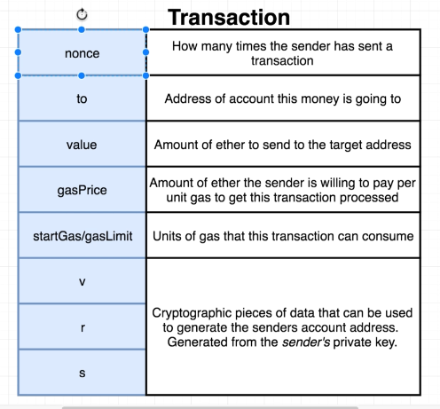
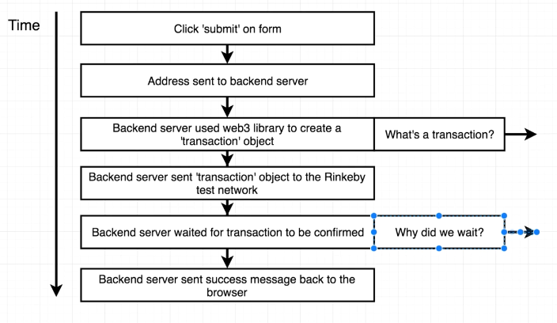

# ABOUT TRANSACTIONS

FOR THE FIRST TIME WE WILL TRY TRANSFER OF ETHER

**WITH METMASK WE HAVE OUR ACCOUNT WHICH IS EXTERNALLY OWNED ACCOUNT**

# RECEIVING ETHERIUM CONIS (TOKENS)

I WILL USE RINKBY TEST NETWORK FOR THIS

OPEN NEW BROWSER TAB AND GO TO <https://www.rinkeby.io/#faucet>

THERE YOU CAN SEND TOKEN OVER RINKEBY NETWORK

AMOUNT OF TOKENS AS YOU SEE IS LIMITED SINCE RINKEBY IS TEST NETWORK PEOPLE TEST (THATS NOT ONLY YOURS TEST NETWORK, AND THERE IS A DANGER OF EXAUSTING FUNDS FROM THE TEST NETWORK, SO AMOUNT YOU CAN SEND IS LIMITED AND ALSO YOU CANT GET NEW TOKENS AFTER SOME TIME)

**ALSO I HAD TO PROVIDE FACEBOOK POST URL WITH MY `ACCOUNT ADRESS`** (AGAIN I;M AYING THAT IS PROTECTION FROM EXAUSTING NETWORKS FUNDS AND TO PREVENT OTHER MALICIOUS STUFF)

I GOT THE TOKENS, AND IT TOOK A BIT TIME WHICH IS NORMAL, THERE IS NO INSTANT TRANSFER, YOU NEED COUPLE SECONDS FOR TRANSACTION

## YOU CAN FIND TRANSACTION LISTED IN METMASK

AND YOU CAN FIND `TRANSACTION ID`

YOU CAN SE FROM WHICH `ACCOUNT ADDRESS` FUNDS WERE SENT
 
ALSO IF YOU CHANGE NEETWORK YOU WILL SEE THAT THERE IS NO FUNDS BECAUSE YOU ONLY RECEIVED FUNDS THROUGH `Rinkeby` NETWORK

# WE CAN OPEN ANOTHER METAMASK ACCOUNT TRY SENDING FROM ONE OF OUR ACCOUNTS TO ANOTHER OF OUR ACCOUNTS

# MORE ON TRANSCTION PROCESS AND OPERATIONS THAT ARE GOING ON BEHIN THE SCENES

THIS IS THE INFO FROM THE TRANSACTION

  
ON THIS PICTURE `BACKEND SERVER` IS SERVER THAT DEVELOPER BUILT WITH `window.web3` (IN NEWER VERSIONS REPLACED WITH `window.ethereum`) AND HE USED THAT API DO DEFINE SENDING OF FUNDS 

UPPER DIGARAM EXPLAINS `Whats a transaction` (THE PART ON NEXT DIAGRAM)

WE WAITED BECAUSE MANY PEOPLE ARE INTERACTING WITH NETWORK BY SENDING/RECEIVING FUNDS, YOU GET ONE NODE THAT HAS COPY OF ENTIRE BLOCKCAHINN (ENTIRE DATBASE)

ALL THE ATTEMPTS OF TRANSACTION ARE QUEUED INSIDE `BLOCK` AND NODE NEEDS TO VALIDATE ALL THAT BLOCK BEFORE ALLOWING IT TO BE STORED IN BLOCKCHAIN

**VALIDATION LOGIC IS MINING**

# TO FIND OUT MORE ABOUT MINING THAT IS COMPLICATED PROCESS CHECK THIS OUT

<https://andersbrownworth.com/blockchain/>

# YOU CAN CHECK THIS OUT TOO SEE AVERAGE BLOCK TIME

<https://etherscan.io/chart/blocktime>