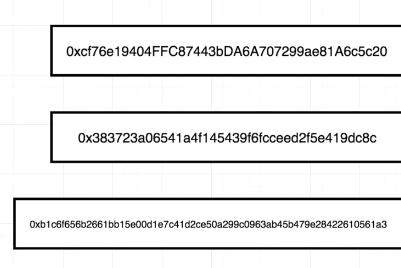

# Learning ethereum and solidity

## HELPFUL RESOURCES

<https://github.com/StephenGrider/EthereumCasts>

# THINGS WE DOING AFTER INITIAL SETUP OF CREATING A WALLET AND SAVING PASSPHRASE (WHICH WE DID WITH `MetaMask`)

SELECT `Rinkeby` TEST NETWORK, BECAUSE WE ARE NOT GOING TO SPEND ANY REAL MONEY; WE WANT TO INTERACT WITH THAT NETWORK WHICH `Rinkeby` IS

# OUR ETHEREUM ACCOUNT HAS 3 KEYS REPRESENTED AS HEXADECIMAL VALUES, THEY CONSTITUTE THE ACCOUNT

sample picture of keys:

`ACCOUNT ADDRESS` (THINK OF IT LIKE AN EMAIL ADDRESS OR USERNAME (**IT TELLS WHO YOU ARE**)) (YOU CAN SHARE THIS KEY) (**THIS CAY IS SHOWN ON METAMASK ANDER Account AND IT HAS COPY BUTTON SO YOU CAN COPY HIM**) 

THESE TWO NEXT KEYS COMBINED FORM A PSSWORD SOME SORTS (**THESE KEYS AUTHORIZE SENDING OF FUNDS FOR YOUR TO OTHER ACCOUNTS**)

`PUBLIC KEY`

`PRIVATE KEY`

**IF YOU DON'T HAVE ACCESS TO PRIVATE KEY YOU DON'T HAVE ACCESS TO SEND FUNDS TO SOMEONE ELSE**

# IN METMASK INTERFACE `ACCOUNT ADRESS` IS ONLY AVAILABLE, ONLY VISIBLE

LIKE YOU SAW

# TO EXPORT ACCOUNTS PRIVATE KEY YOU CAN DO THIS (I WILL TELL LATER ABOUT )

***

THIS KEY IS NOT TIED TO YOUR `PRIVATE KEY` OR `PUBLIC` KEY

**THIS IS ONLY METAMASK ACCOUNT PRIVATE KEY**

***

GO TO ACCOUNT DETAILS (THREE DOTS MENU THEN ACCOUNT DETAILS)

THERE YOU CAN BE PROMPTED TO ENTER PASSWORD (YOUR METAMASK PASSWORD) AND EXPORT YOUR PRIVATE KEY

# YOUR KEYS (ALL THREE) ARE HEXADECIMAL VALUES

OPEN BROWSER CONSOLE AND PASS ACCOUNT KEY THERE AND PRESS ENTER

THE ACCOUNT ADDRESS KEY IN HEX FORMAT WILL BE TRANSFERED TO Base10 NUMBER (TAHTS A NUMBER WITH EXPONENT)

THATS A LONG LONG NUUMBER (VERY LARGE)

# IF SOMEONE MALICIOUS OBTAINS YOUR PRIVATE KEY, HE CAN TAKE ALL OF YOUR FUNDS

DON'T SHARE IT WITH OTHER PEOPLE

PRIVATE KEY IS IMBOSSIBLE TO GUESS BECAUSE IT IS SUCH A LARGE NUMBER (MORE CHANCE TO WIN A LOTTERRY)

# NO METTER YOU CHANGE NETWORKS, YOU GO BACK FROM MAIN NETWORK TO SOME OF THE TEST, OR OPPOSITE, YOUR KEYS ARE THE SAME FOR EACH NETWORK

SO YOU CAN HAVE ONE ACCOUNT ACROSS EACH NETWORK YOU CONNECT

OF COURSE THERE IS NO LIMIT FOR YOU IN TERMS OF MAKING HOW MUCH ACCOUNTS YOU WANT